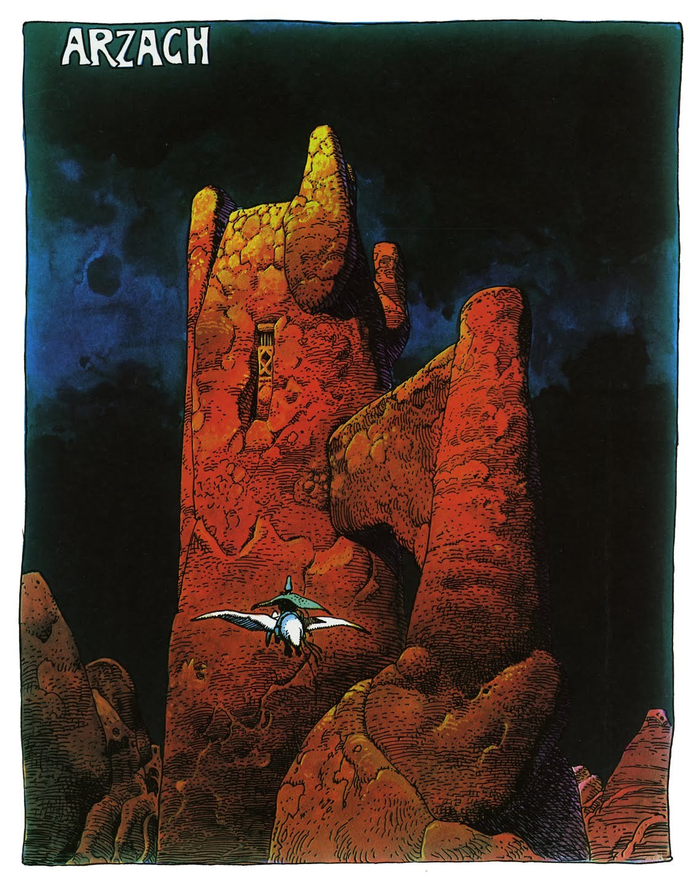

Blogging is something that I've been meaning to do more consistently for a long time. Looking back, I think the biggest factor in my failure to keep up with a blog, besides the common and obvious excuse of there not being enough time in the day, is that I was never really happy with the format or content that I've produced.

<figure class="floatRight">
	
	<figcaption>My old site, So fresh, so clean and so minimal</figcaption>
</figure>

The blogs I've created up until now have suffered by having technical issues that kept me from getting really excited about writing online, mainly either they weren't as flexible/customizable as I wanted or that ended up looking to cluttered. I think the content issues stemmed from not writing what I really wanted to be writing about. Between then and now I went with the cool kid approach of just having a page with links to my github, linkedin, etc. but I decided I wanted a place to write about the things that I've been doing to share with others.

Then again, maybe I just needed to learn and experience more before I felt the desire to start blogging. The truth is probably a mix of all of these. What will follow are posts on various things that I've learned and that I've built as well as some things that inspire me. It's my goal that it will be useful for myself in the future as well as for other people who have helped me on my learning journey.

### In which I talk about what technology I used and why
I decided to try out some new technology and will update this blog with posts about the things I'll inevitably to do update it. I decided to use the [Gatsby](https://github.com/gatsbyjs/gatsby) blog-focused starter kit [Lumen](https://github.com/wpioneer/gatsby-starter-lumen). Gatsby is a React.js static site generator that supports markdown out of the box and I decided on Lumen because the design was minimal and it had the functionality that I was looking to start off with while being built with Webpack and React, two web technologies that I'm very familiar with a comfortable extending.

I'll end this post with an image from one of my favorite illustrators, Moebius. 

<figure>
	
	<figcaption>From Moebius' Arzach, about to conquer mt. blog</figcaption>
</figure>

